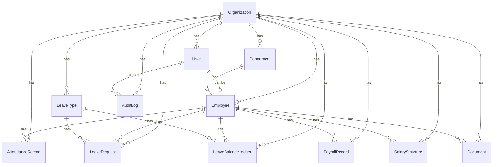

# Dayflow — HRMS Application

> Every workday, perfectly aligned.

A modern HR Management System built with Next.js 16 (App Router), TypeScript, Tailwind CSS, shadcn/ui, Prisma ORM, and PostgreSQL.

---

## Getting Started

### Prerequisites

- **Node.js** ≥ 18
- **PostgreSQL** — either a local instance or a hosted service (Neon, Supabase, etc.)

### 1. Clone and install

```bash
git clone https://github.com/chethankotian2005/HRMS-Odoo.git
cd HRMS-Odoo
npm install
```

### 2. Configure environment

```bash
cp .env.example .env
```

Edit `.env` and fill in your values:

| Variable | Description |
|---|---|
| `DATABASE_URL` | PostgreSQL connection string |
| `NEXTAUTH_SECRET` | Generate with `openssl rand -base64 32` |
| `NEXTAUTH_URL` | `http://localhost:3000` for local dev |

### 3. Set up the database

```bash
npx prisma migrate dev      # Apply migrations and generate client
npm run seed                 # Seed demo data (30 employees, attendance, leave, payroll)
```

### 4. Start the development server

```bash
npm run dev
```

Open [http://localhost:3000](http://localhost:3000) in your browser.

### Demo Credentials

All demo accounts use password: **`Admin@1234`**

| Role | Email |
|---|---|
| Admin | `priya.sharma@acme.in` |
| HR | `rajesh.kumar@acme.in` |
| Employee | `arun.mehta@acme.in` |

---

## Project Structure

```
src/
├── app/                    # Next.js App Router pages and API routes
│   ├── (app)/              # Authenticated app shell (sidebar + auth guard)
│   │   ├── admin/          # Admin-only pages (dashboard, leave approvals, payroll)
│   │   ├── attendance/     # Employee attendance view
│   │   ├── dashboard/      # Employee dashboard
│   │   ├── employees/      # Employee profile, edit, payroll
│   │   └── leave/          # Leave listing and application
│   ├── api/                # API route handlers
│   ├── login/              # Login page
│   └── signup/             # Signup page
├── components/             # Shared React components
│   ├── ui/                 # shadcn/ui primitives
│   ├── app-shell.tsx       # Sidebar + top bar layout
│   └── providers.tsx       # NextAuth SessionProvider wrapper
├── lib/                    # Shared utilities and business logic
│   ├── leave/              # Leave balance (ledger-based)
│   ├── payroll/            # Payroll computation
│   ├── rbac/               # Role-based access control policies
│   ├── audit.ts            # Audit log writer
│   ├── holidays.ts         # Public holiday list + working-day utils
│   └── prisma.ts           # Prisma client singleton
└── types/                  # TypeScript type augmentations
prisma/
├── schema.prisma           # Database schema
├── seed.ts                 # Idempotent seed script
└── migrations/             # Prisma migration history
```

---

## Key Features

- **Attendance** — GPS geofencing, device fingerprinting, proxy detection
- **Leave Management** — Ledger-based balance tracking, annual grants, approval workflows
- **Payroll** — Automated computation with PF, professional tax, LOP deductions
- **RBAC** — Role-based access control (Admin, HR, Employee)
- **Audit Trail** — Immutable audit log for all mutations
- **IST-safe dates** — All calendar-day comparisons use `format(date, 'yyyy-MM-dd')`, never `setHours` + `toISOString`

---

## Entity Relationship Diagram (ERD)


